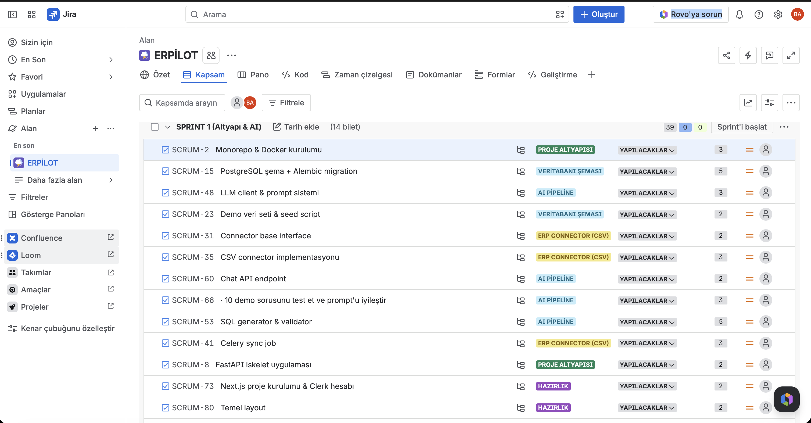
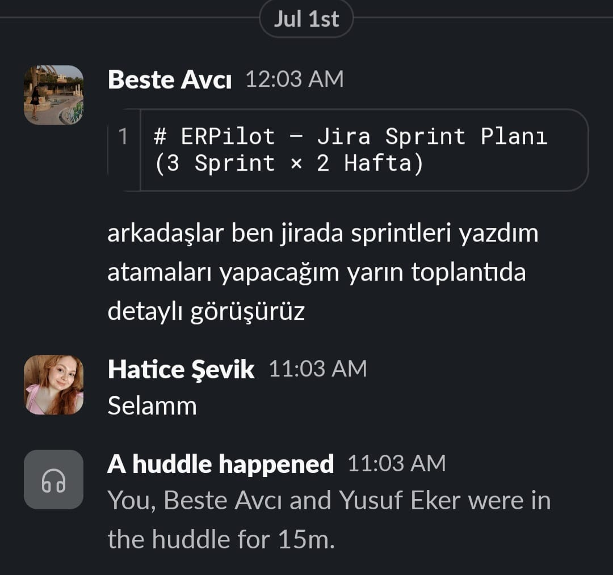
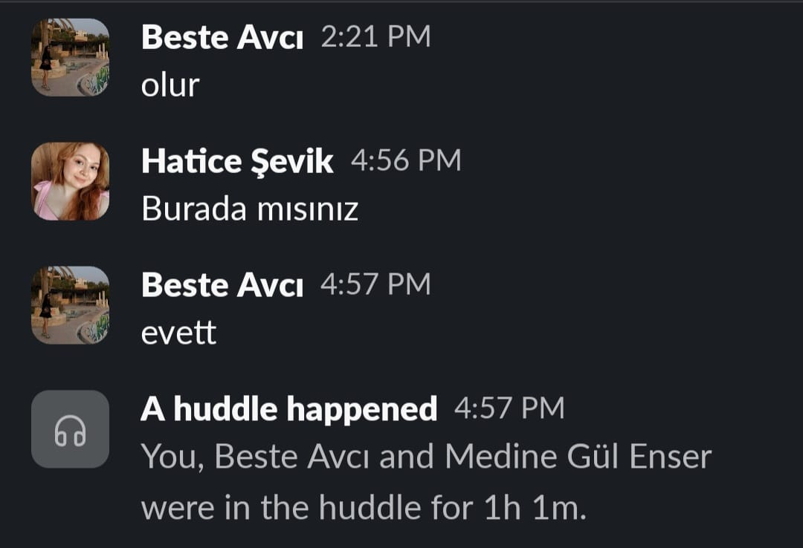
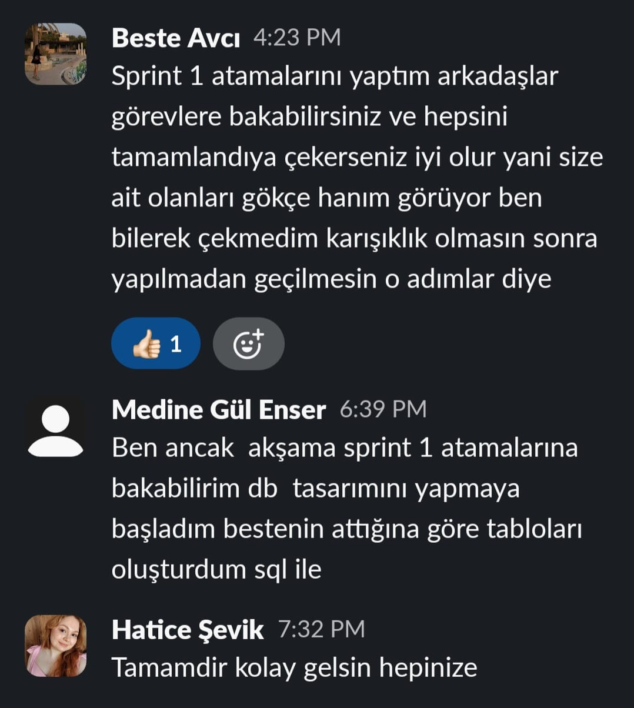
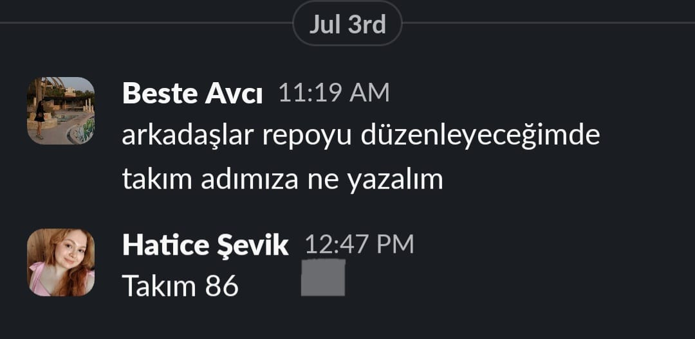
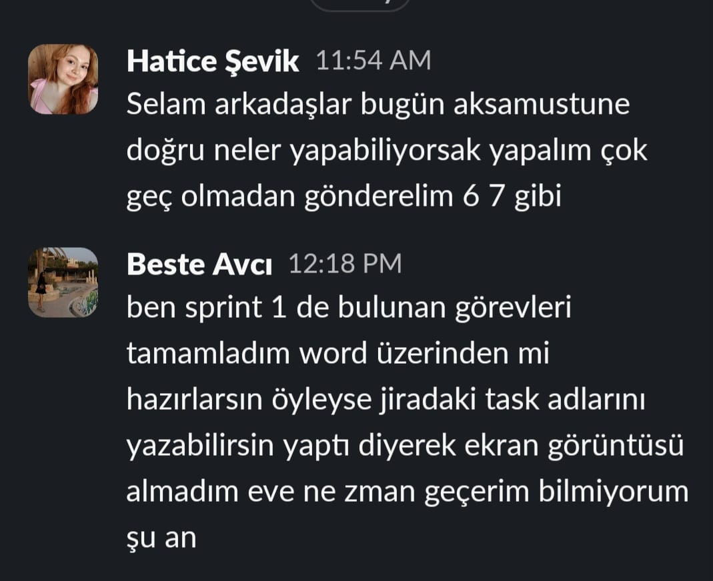
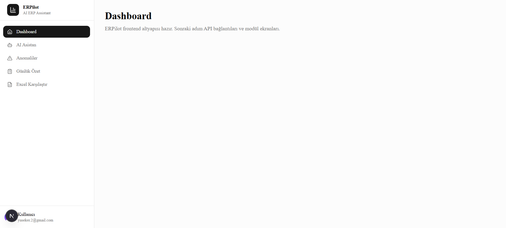
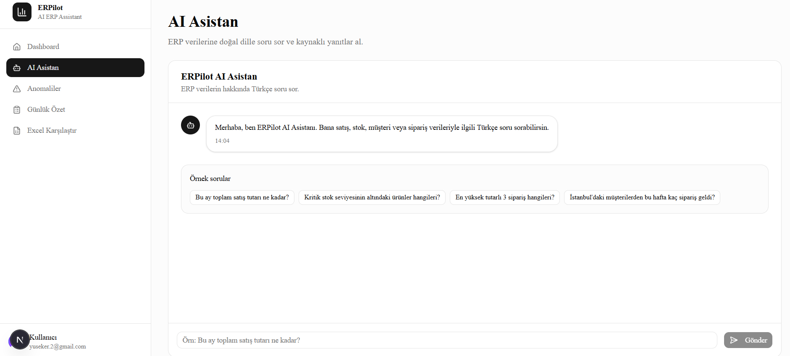

# Takım İsmi

Ekip 86

# Takım Üyeleri

- **Beste Avcı** - Product Owner
- **Medine Gül Enser** - Backend Developer
- **Yusuf Eker** - Frontend Developer
- **Hatice Şevik** - Scrum Master

# Ürün İsmi

ERPilot

# Product Backlog URL

[Ekip 86 Jira Backlog](https://ogr-team-k0v7xpmp.atlassian.net/jira/software/projects/SCRUM/boards/1/backlog?atlOrigin=eyJpIjoiYjgwZGI4ZTAwYTU3NDQ5MjgxZjg0Y2UxN2QwODIzYTciLCJwIjoiaiJ9)

# Ürün Açıklaması

ERPilot, işletmelerin ERP verilerini (sipariş, stok, müşteri, finans) doğal dilde Türkçe sorularla sorgulamasını sağlayan yapay zekâ destekli bir asistan platformudur. Kullanıcılar "Bu ay en çok satan ürün hangisi?" gibi sıradan bir soru sorar, ERPilot bu soruyu arka planda SQL sorgusuna çevirip anlaşılır bir yanıt olarak sunar. Ayrıca stok/sipariş verilerindeki anormallikleri otomatik tespit eder, Excel dosyalarını sistemdeki veriyle karşılaştırır ve her gün özet raporlar (digest) üretir.

# Ürün Özellikleri

- Doğal dilde (Türkçe) sorgulama — Text-to-SQL / RAG tabanlı sohbet modülü
- ERP Connector mimarisi — CSV ile başlayıp SAP B1 / Logo gibi sistemlere genişleyebilen eklenti yapısı
- Anomali tespiti — sipariş ve stok verilerinde olağan dışı durumları otomatik yakalayan kural motoru
- Excel karşılaştırma (diff) — yüklenen Excel dosyasını sistemdeki veriyle karşılaştırma
- Günlük özet (digest) — LLM destekli otomatik durum raporu
- Güvenlik & yetkilendirme — Clerk tabanlı auth, rol bazlı erişim (admin/user/viewer), audit log
- Dashboard — rol bazlı metrik kartları ve hızlı erişim ekranı

# Hedef Kitle

- KOBİ ölçekli işletmelerin operasyon, finans ve satış ekipleri
- ERP verisini teknik bilgi gerektirmeden sorgulamak isteyen karar vericiler
- Stok ve sipariş süreçlerinde anomali takibi yapmak isteyen operasyon yöneticileri
- Manuel Excel karşılaştırmasından kurtulmak isteyen finans/muhasebe ekipleri

---

# SPRINT 1

- **Sprint içi puan değerlendirmesi** 39 olarak belirlenmiştir.
- **Puan tamamlama mantığı:** Proje boyunca tamamlanması gereken backlog puanı 115'tir. İlk Sprint için bitirilmesi istenilen puan sayısı 39 olarak belirlenmiştir.
- **Sprint Hedefi:** Docker ile çalışan backend, veritabanı şeması, CSV veri akışı ve ilk çalışan Text-to-SQL sorgusu.
- **Definition of Done:** `docker compose up` tek komutla kalkar; Postman'den chat sorusu atılır ve SQL üretilir.
- **Daily Scrum:** Slack üzerinden günlük görüşmeler sağlanmıştır. Ekip tek grup olarak ilerlemiştir.

- **Görev Dağılımı Mantığı:** Backend (P2) ve Frontend (P3) tarafı, mimariyi belirleyen Tech Lead (P1) ile eş zamanlı çalışmıştır. Test ve deployment (P4) her sprint sonunda devreye girmiştir.
- **Sprint 1 Görev Sahipleri:** Beste Avcı (P1), Medine Gül Enser (P2).
- **Sprint 1 board update:** Sprint Board Screenshot:

**Sprint 1 Görev Özeti**

| Task | Atanan | SP | Epic |
|------|--------|----|------|
| TASK-001 Monorepo & Docker kurulumu | P1 | 3 | Proje Altyapısı |
| TASK-002 FastAPI iskelet uygulaması | P1 | 2 | Proje Altyapısı |
| TASK-003 PostgreSQL şema + Alembic migration | P2 | 5 | Veritabanı Şeması |
| TASK-004 Demo veri seti & seed script | P2 | 2 | Veritabanı Şeması |
| TASK-005 Connector base interface | P1 | 2 | ERP Connector (CSV) |

## Daily Scrum

Daily Scrum toplantıları zaman kısıtları nedeniyle Slack üzerinden yazılı olarak yürütülmüştür. Örnek ekran görüntüleri:

## Ürün Durumu: Ekran Görüntüleri

Ürün Durumu ekran görüntüleri, sprint bitimine kadar ilgili görevlerin tamamlanamaması nedeniyle bu sprint raporuna eklenememiştir.

## Sprint Review

Sprint 1 hedefine kısmen ulaşılmıştır.

**Tamamlanan görevler:**
- TASK-001 (Monorepo & Docker kurulumu), TASK-002 (FastAPI iskelet uygulaması), TASK-005 (Connector base interface) tamamlanmış ve GitHub'a yüklenmiştir.
- TASK-014 (Excel servis araştırması & anomali kural tasarımı) POC ve doküman olarak tamamlanmış, kod Sprint 2'de gerçek implementasyona dönüştürülecektir.

**Tamamlanmayan görevler:**
- TASK-003 (PostgreSQL şema + Alembic migration) ve TASK-004 (Demo veri seti & seed script) sprint bitimi itibarıyla tamamlanmamıştır.
- TASK-012 (Next.js proje kurulumu & Clerk entegrasyonu) ve TASK-013 (Temel layout & sidebar) sprint bitimi itibarıyla tamamlanmamıştır.

Bu görevler Sprint 2'ye devredilecek ve öncelikli olarak ele alınacaktır. Backend altyapısının (Docker, FastAPI, connector base) ve Excel/anomali araştırmasının tamamlanmış olması, Sprint 2'nin bu görevler üzerine inşa edilebilmesi açısından olumludur; ancak veritabanı şeması ve frontend kurulumunun eksik kalması Sprint 2'nin başlangıcını geciktirme riski taşımaktadır.

Sprint Review katılımcıları: Beste (Product Owner), Hatice (Scrum Master).

## Sprint Retrospective

- Görev dağılımı, roller net şekilde belirlendi; backend altyapısının temel taşları (Docker, FastAPI, connector base) ve Excel/anomali araştırması zamanında tamamlandı.
- Ekibin bir kısmı sprint görevlerini tamamlayamadı; bu durum Sprint 2'nin bağımlı görevlerini (veritabanı üzerine kurulacak backend işleri, frontend'e bağlı özellikler) geciktirme riski taşıyor. 
- Sprint 2'de değiştirilecek: Görev ilerlemesi daily scrum'da yüzde tamamlanma veya blocker bildirimiyle daha net paylaşılacak; geciken görevler için sprint ortasında bir ara kontrol (mid-sprint check-in) yapılacak; tamamlanamayan görevlerin nedeni (zaman yönetimi mi, teknik engel mi) netleştirilip gerekirse görev yeniden dağıtılacak.

---

# SPRINT 2

- **Sprint içi puan değerlendirmesi** 43 olarak belirlenmiştir.
- **Puan tamamlama mantığı:** Proje boyunca tamamlanması gereken backlog puanı 115'tir. İkinci Sprint için bitirilmesi istenilen puan sayısı 43 olarak belirlenmiştir.
- **Sprint Hedefi:** Kullanılabilir chat arayüzü, anomali paneli, Excel vs ERP karşılaştırma modülü çalışır; Clerk auth ve RBAC aktif; tenant izolasyonu doğrulanır.
- **Definition of Done:** Tarayıcıdan login olunur, soru sorulur, anomaliler görüntülenir, Excel fark raporu üretilir, admin/user rol ayrımı çalışır.
- **Daily Scrum:** Whatsapp üzerinden günlük görüşmeler sağlanmıştır. Ekip tek grup olarak ilerlemiştir.

- **Görev Dağılımı Mantığı:** 
- **Sprint 2 Görev Sahipleri:** 
- **Sprint 2 board update:** Sprint Board Screenshot:

**Sprint 2 Görev Özeti**

| Task | Atanan | SP | Epic |
|------|--------|----|------|
| TASK-015 Chat UI | P3 | 5 | Chat |
| TASK-016 Sohbet geçmişi | P3 | 2 | Chat |
| TASK-017 Clerk JWT backend | P1 | 3 | Güvenlik |
| TASK-018 RBAC middleware | P1 | 2 | Güvenlik |
| TASK-019 Audit log servisi | P4 | 3 | Güvenlik |
| TASK-020 ERP credential şifreleme | P4 | 2 | Güvenlik |
| TASK-021 Güvenlik & tenant izolasyon testleri | P1 | 2 | Güvenlik |
| TASK-022 Anomali kural motoru | P4 | 5 | Anomali |
| TASK-023 Celery anomali job | P2 | 2 | Anomali |
| TASK-024 Anomali UI | P3 | 3 | Anomali |
| TASK-025 Excel upload backend | P4 | 4 | Excel |
| TASK-026 Excel diff motoru | P4 | 5 | Excel |
| TASK-027 Excel diff UI | P3 | 3 | Excel |
| TASK-028 ERP bağlantı UI | P3 | 2 | ERP |

## Daily Scrum

Daily Scrum toplantıları kolay iletişime geçebilmek nedeniyle Whatsapp üzerinden yazılı olarak yürütülmüştür. Örnek ekran görüntüleri:

## Ürün Durumu: Ekran Görüntüleri

Ürün Durumu ekran görüntüleri aşağıdaki gibidir.

## Sprint Review

## Sprint Retrospective

